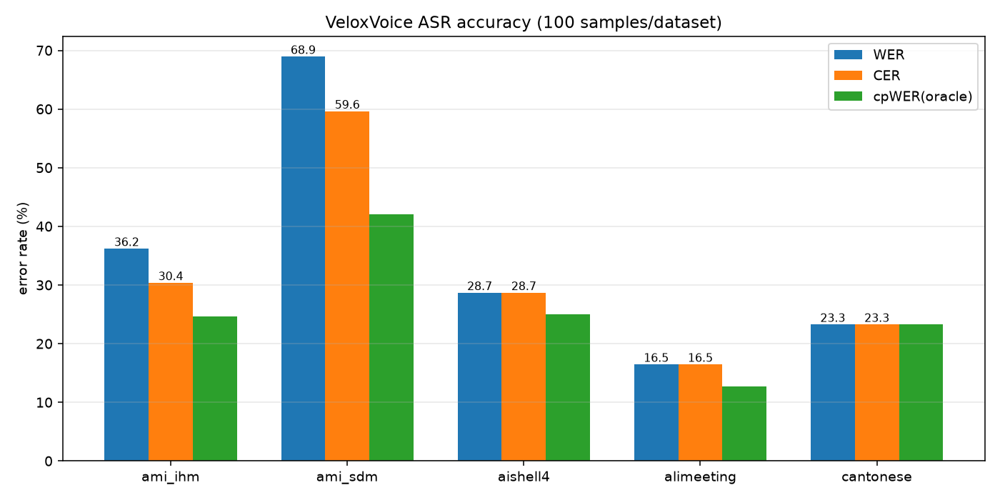

<div align="center">
  <p align="center">

  <picture>
    
  </p>

  <h3>🎙️ Velox Voice :  Frontier Voice Cross Platforms (Hopper / DGX Spark / MacStudio) Inference Engine with JIT Kernels</h3>
  <a href="#cite-us">📝 Papers</a> | <a href="#QuickStart">🚀 Quick Start</a> | <a href="#support-dits">🎯 Supported Velox Voice JIT Kernels</a> | <a href="#dev-guide">📚 Dev Guide </a> | <a href="https://github.com/yiakwy-xpu-ml-framework-team/flash-float-jit-kernels/discussions">📈  Discussion </a> | <a href="#Highlight">📝 Highlight </a></strong>
  <p></p>

</div>

This repository is porting our "Flash Float JIT Kernels" into audio task. Besides practical conformer (see below) with JIT kerenls, we are also supporting frontier audio tasks with AR models with JIT kernels from frontier audio lab.

<h2 id="highlight"> Highlight </h2>

- Sep 10 2026, [🔥 Transcribing 1 hour candonese audio within few seconds on DGX Spark , RTF 0.001 (x1000 acceleration) 🚀 with almost good Condonese Recoginition 🎯!](#Transcribing-1-hrs-audio-in-seconds-on-dgx-spark)

<h2 id="Transcribing-1-hrs-audio-in-seconds-on-dgx-spark">🔥 Transcribing 1 hour audio in seconds on DGX Spark</h2>

**Transcribing 1 hour audio into few seconds**

<div align="center">
  <video src="https://github.com/user-attachments/assets/fd26e9dc-9830-4d6a-a243-0d17ae425254" width="60%"> </video>
</div>

Priro VeloxVoice, long audio transcribing with wenet alike model (Conformerencoder + CTC) suffers from extremely computation imbalance.

Take the [power mel log](https://github.com/yiakwy-xpu-ml-framework-team/flash-float-jit-kernels/pull/33) for example usually has matrix shape of **[T, M]**, where **M** is **80** dependent on the audio sampling rate and **T** is framees depending on the duration of the audio. As a result for a long audio, traditional torch gemm does not handle this computation characteristics efficiently.

We identified the issue and propose solutions with fuse JIT kernel operations tackle that bottlenect.

In DGX Spark, our latest results shows that we can achive RTF **0.0015** for 1 hour audio, while on Hopper platform, RTF **0.0003** is achieved.

This restul fundamental changed streaming logics of previous audio task, where **velox voice** is good for.


| workload                    | GPU              | wall       | RTF        |
|-----------------------------|------------------|------------|------------|
| baseline (torchscript lane) | dgx spark (GB10) |   3.52 s   | 0.0353     |
| 99.6 s audio                | dgx spark (GB10) | **99 ms**  | **0.0010** |
| multi worker, 1 h audio     | dgx spark (GB10) |   5.3  s   | **0.0015** |
| multi worker, 1 h audio     | Hopper superPod  | **997 ms** | **0.0003** |


## Overview

One python frontend, two module backends : PyTorch torch modules on
NVIDIA GB10/H800, MLX modules on Apple M3.

No/Less CPU : Every stage of the streaming chunk loop stays on the accelerator and is driven by custom JIT kernels.

| Platform                      | Python frontend | Kernel path                                    | Chunk execution                       |
|-------------------------------|-----------------|------------------------------------------------|---------------------------------------|
| H800 (Hopper, sm_90a)         | torch modules   | CUDA `csrc/` FP8 scaled WASP wgmma             | eager / piecewise / fused CUDA graphs |
| DGX-Spark (GB10, sm_121a)     | torch modules   | CUDA `csrc/dgx/` NVFP4 WASP / multi stage mma  | eager / piecewise / fused CUDA graphs |
| Mac Studio (M5/M3 Ultra/Mini) | mlx modules     | Metal (`mx.fast.metal_kernel`)                 | mx.compile segments + `async_eval`    |

#### Hardware Requirements

- Hopper SuperPod : CUDA 12.8/13.0, driver > 580 (compatible for CUDA13)
- DGX Spark : CUDA 13.0
- M5/M3 Ultra : mlx-lm, mlx latest, details will be updated soon.
- Torch 2.10
- Triton (3.7+)

## How do we transcribe audio ?

Follow the gold standard GPU fbank from Kaldi, we implemented GPU JIT kernels such as `power_mel_log`, `CMVN`, `pwlin` (conv1), `fused layer norm` and so on so forth on DGX spark.

Before sending audio chunk to Went Conformer on GPU, we unified continous (fbank) Tokenizer against discret codebook tokenier with compaction in AR model.

CTC greedy decode is also playing an important role for peak performance. Traditional implementation transfer to tokens in and out from GPU frequent remove duplicates and we maximize the duration on GPU and use piecewise graph capture to accleration computation.

#### Usage:

**Transcribe API**

```python
# NOTE (yiakwy) : veloxvoice.api, veloxvoice.stream are pending, use the API belows
from veloxvoice import Velox
vx = Velox.load("/path/to/model-dir")          # giant: final.zip / asr_model.pt / units.txt / train.yaml hosted by HF, e.g. : data/models/asr_model in our usage case
session = vx.new_session()
session.accept(pcm_chunk)                      # streaming of raw PCM
print(session.text())                          # real lyrics (LLM text matched by WER/Torchscript ref)
```

**Using ASR Model for short audio**

```bash
ROOT="$( cd "$( dirname "${BASH_SOURCE[0]}" )/" && pwd  )"

audio=$ROOT/speaker_test/meeting-test.wav
model=$ROOT/data/models/asr_model

python $ROOT/tools/bench_wenet.py \
         --model-dir $model --audio $audio --use-jit
```

**Using ASR Model for long (1 hour) audio**

```bash

ROOT="$( cd "$( dirname "${BASH_SOURCE[0]}" )/" && pwd  )"

# WENET_INPROC_MAX_CALLS:
#   9999/unset : encode per-spans in-process (multi-threaded CUDA-stream
#                 pipeline; frontend runs once, no subprocess spawn cost)
#   3          : fresh subprocess workers for spans>3 calls
export WENET_INPROC_MAX_CALLS=9999

# WENET_PAR_WORKERS (subprocess path only; the threaded in-proc path ignores it):
#   serial : one worker processes ALL span groups sequentially (default;
#             workers share one GPU, so parallel CUDA contexts only contend)
#   <N>    : run N span-groups concurrently (helps only if workers are
#             CPU/IO-bound, not GPU-bound)
# export WENET_PAR_WORKERS=serial


audio=$ROOT/speaker_test/meeting-test.wav
model=$ROOT/data/models/asr_model

python $ROOT/tools/bench_wenet_multi_worker.py \
         --iters 3 \
         --model-dir $model --audio $audio --use-jit --fp16
```

**Uasing AR ASR Model**

For the moment we mainly use Conformer (trained from scatch) to transcribe audio, we will add AR model support soon.

## Feature set

**Kernels** (`veloxvoice/kernels/`):

- csrc/:
  - `velox_power_mel_log` : extremely unbalanced GEMM in long duration audio task
  - `velox_layernorm`, `velox_silu_glu`, `velox_depthwise_causal_conv1d` : opt w/ NoC
  - `velox_chunk_rel_pos_attn` : masked rel-pos multi-head attention (opt WIP)
  - `velox_fused_qkv` : small-m fused GEMV
  - `flash-float-jit-kernel : distRadixTopK` : ctc produce [T, 14128] logits, our exact match topk is good to deal with this kind of sequence length
- csrc/dgx/ (DGX-Spark sm_121a):
  - **WASP 1p2c packed nvfp4/mxfp4 GEMM** with NoC and warp level m16n8k64
    `mma.sync.aligned.kind::mxf4nvf4.block_scale` with e8m0 scales.
- triton3_7/: gluon references for the same ops.
- csrc/mlx/: Metal urban suite:
  - `depthwise-causal-conv1d`, `silu_glu`, `power_mel_log` : metal kernel support
  - **sub-1bit streamk GEMM** multi stage XOR matrix-multiply acculation (mma)
  - **stream GEMM** multi stage metal simdgroup mma
  - layernorm
  - chunk_rel_pos_attn

Also see report from [flash-float-jit-kernel](https://github.com/yiakwy-xpu-ml-framework-team/flash-float-jit-kernels/pull/33).

**Graphs**: eager / piecewise CUDA graph / MLX metal-graph

**Tokenizer**: TextTokenizer (asr_model/units.txt mapping for CTC), VoiceTokenizer
(continuous + FSQ-discrete per chunk).

## Performance of common test

Instead of the proprietory 1 hour Candonese audio, we also try the common availabel mp3 file in English.

#### DGX Spark (GB10, sm_121a) on Sep 10 2026 — LibriVox 12 min

Same workload and command as the Hopper table above

> `tools/bench_wenet.py --audio /tmp/librivox.mp3 --use-jit`

with bf16 frontend, and JIT kernels: fused power-mel-log + layernorm + silu_glu; long audio segmented into 6
spans at the pos_pe window:

| Metric                                        | Value                                 |
|-----------------------------------------------|---------------------------------------|
| ffmpeg decode + resample (mp3 → 16 kHz mono)  | 723.62 s, 6 segments                  |
| verify: JIT-ON ≡ JIT-OFF                      | tokens_same=True, max\|Δenc\|=0.00000 |
| encoder wall (6 segments)                     | 1614.71 ms → encoder RTF **0.0022**   |
| CTC logp + greedy decode                      | 113.0 ms                              |
| end-to-end wall (decode+frontend+encode+CTC)  | 3218.09 ms → **total RTF 0.0044**     |

#### Hopper (NVIDIA H800, sm_90a, CUDA 12.8, torch 2.10.0+cu128) on Sep 10 2026 — LibriVox 12 min

Same workload and command as the DGX Spark table above :

| Metric                                        | Value                              |
|-----------------------------------------------|------------------------------------|
| ffmpeg decode + resample (mp3 → 16 kHz mono)  | 723.62 s, 6 segments               |
| verify: JIT-ON ≡ JIT-OFF                      | tokens_same=True, max\|Δenc\|=0.00000 |
| encoder wall (6 segments)                     | 309.52 ms → encoder RTF **0.0004** |
| CTC logp + greedy decode                      | 5.7 ms                             |
| end-to-end wall (decode+frontend+encode+CTC)  | 1574.89 ms → **total RTF 0.0022**  |

**Cross-platform:**

H800 is ~5.2× faster on the encoder (0.0004 vs 0.0022 RTF), ~2× faster end-to-end (0.0022 vs 0.0044 RTF).

Both platforms produce identical tokens (n=548) in this test.

## Install

Device-agnostic deps live in `requirements/common.txt`; the accelerator stack
is per-device and referenced with `-r`:

```bash
pip install -r requirements/requirements-cuda.txt   # DGX Spark / H800 (torch cu130 wheels)

# NOTE (yiakwy) : pending to update
pip install -r requirements/requirements-mlx.txt    # Apple Silicon
```

## Accuracy (WER/CER, 100 samples per set — tools/bench_accuracy.py)

| dataset (50 samples)                 | WER%  | CER%  | cpWER% (oracle spk) |
|--------------------------------------|-------|-------|---------------------|
| AMI IHM (English, headset)           | 36.20 | 30.37 | 24.59 |
| AMI SDM (English, far single mic)    | 68.94 | 59.62 | 42.08 |
| AISHELL-4 (Mandarin meetings)        | 28.67 | 28.67 | 25.01 |
| AliMeeting (Mandarin far-field, 8k)  | 16.45 | 16.45 | 12.70 |
| Cantonese (cantonese_daily)          | 23.26 | 23.26 | 23.26 |

<picture>
  
</picture>

We follow the [VibeVoice](https://github.com/microsoft/VibeVoice) project to produce the benchmark.

English sets are out-of-domain for this WenETSpeech-trained model; cpWER with
oracle speaker attribution recovers most of the meeting-set gap.

TF32 `mma.sync` **truncates** (RZ) unconverted fp32 operands may attributed to
the mis-recognition (see tests/kernels/test_power_mel_log.py).
